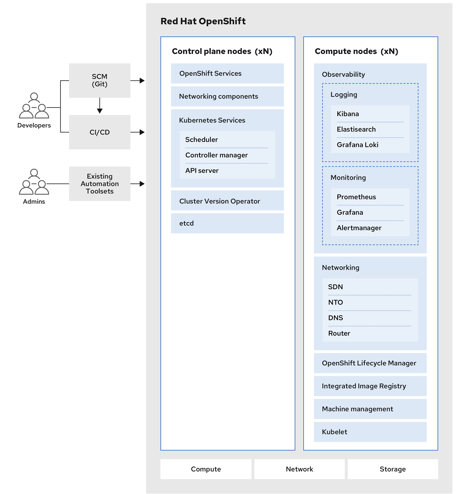

Product Architecture

you can read more documentation on the official website https://docs.okd.io/latest/architecture/architecture.html

NODE	                                                HOSTNAME	            IP ADDRESS	MEMORY	vCPU	STORAGE
Manager Node (DNS, HAProxy, Nginx) - CentOS-Stream-8	apps	                16.16.0.13	4GB	    4	    50GB
Bootstrap Node - Fedora CoreOS	                        okd4-bootstrap	        16.16.0.14	16GB	4	    50GB
Control Node-1 - Fedora CoreOS	                        okd4-control-plane-1	16.16.0.15	16GB	4	    50GB
Control Node-2 - Fedora CoreOS	                        okd4-control-plane-2	16.16.0.16	16GB	4	    50GB
Control Node-3 - Fedora CoreOS	                        okd4-control-plane-3	16.16.0.17	16GB	4	    50GB