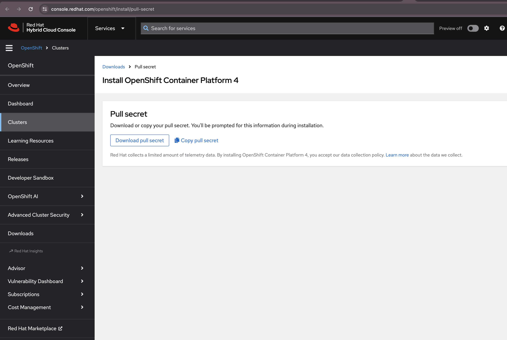
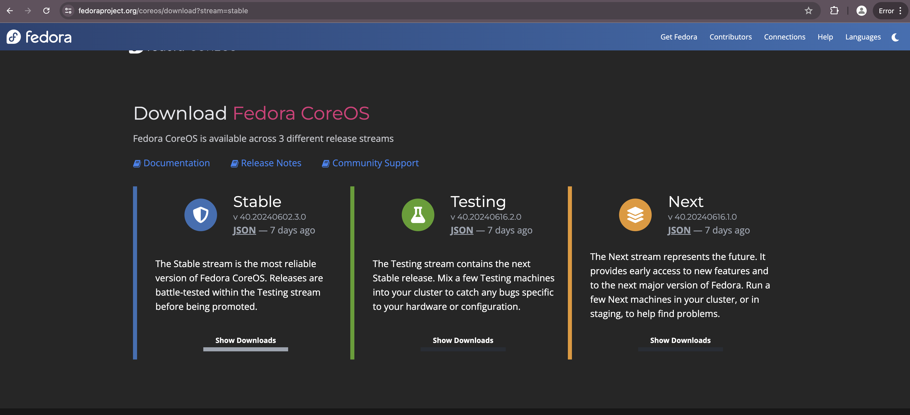
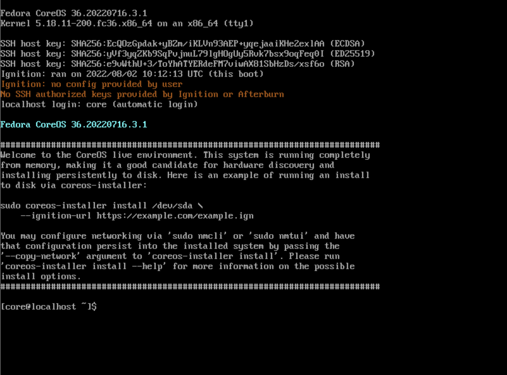

Install OKD 4 that is the upstream version of Red Hat OpenShift 4.
This example is based on the environment like follows.

| NODE	                                               | HOSTNAME	           | IP ADDRESS	   | MEMORY  | vCPU	| STORAGE
| ---------------------------------------------------- |-----------------------|---------------|---------|------|----------
| Manager Node (DNS, HAProxy, Nginx) - CentOS-Stream-9 | apps	               | 16.16.0.13	   | 4GB	 | 4	|    50GB
| Bootstrap Node - Fedora CoreOS	                   | okd4-bootstrap	       | 16.16.0.14    | 16GB	 | 4	|    50GB
| Control Node-1 - Fedora CoreOS	                   | okd4-control-plane-1  | 16.16.0.15    | 16GB	 | 4	|    50GB
| Control Node-2 - Fedora CoreOS	                   | okd4-control-plane-2  | 16.16.0.16    | 16GB	 | 4	|    50GB
| Control Node-3 - Fedora CoreOS	                   | okd4-control-plane-3  | 16.16.0.17    | 16GB	 | 4	|    50GB

1. ## Install and Configure dnsmasq
We will begin by setting up Dnsmasq on the manager node to resolve the requests for the Kubernetes cluster

- ### Install dnsmasq

```[root@mngr-node ~]# dnf -y install dnsmasq```

- ### Configure Dnsmasq
```[root@mngr-node ~]# vim /etc/dnsmasq.conf```
```
port=53
domain-needed
bogus-priv

strict-order
expand-hosts
domain=okd.local.com
address=/apps.okd.local.com/16.16.0.13
```

my domain name is local.com and 16.16.0.13 resolves all the requests directed to apps.okd.local.com. Once the desired changes have been made, save the file and restart the service:

```
[root@mngr-node ~]# systemctl restart dnsmasq
[root@mngr-node ~]# systemctl enable --now dnsmasq
```

- ### Configure DNS Records
Now add the DNS records to /etc/hosts. Dnsmasq will reply to all requests using the records here.
```
[root@mngr-node ~]# vim /etc/hosts
```
```
16.16.0.13 api-int.okd.local.com               api 
16.16.0.14 okd4-bootstrap.okd.local.com        okd4-bootstrap
16.16.0.15 okd4-control-plane-1.okd.local.com  okd4-control-plane-1
16.16.0.16 okd4-control-plane-2.okd.local.com  okd4-control-plane-2
16.16.0.17 okd4-control-plane-3.okd.local.com  okd4-control-plane-3
```
Also modify /etc/resolv.conf:
```
search okd.local.com
nameserver 16.16.0.13
nameserver 8.8.8.8
```
Restart dnsmasq;

```[root@mngr-node ~]# systemctl restart dnsmasq```

Allow firewall;

```
[root@mngr-node ~]# firewall-cmd --permanent --add-port=53/udp
[root@mngr-node ~]# firewall-cmd --reload
```
Test if the service is working as desired;
```
[root@mngr-node ~]# dig api-int.okd.local.com
```

2. ## Install and Configure Nginx
This will used to serve the ignition file to other nodes

- ### Install nginx
```
[root@mngr-node ~]# dnf -y install nginx
```
- ### Configure Nginx
```
[root@mngr-node ~]#	vim /etc/nginx/nginx.conf
```
```
 server {
        listen       8080;
        listen       [::]:8080;
        server_name  okd.local.com;
        root         /usr/share/nginx/html;
    }
```
```
[root@mngr-node ~]# systemctl enable --now nginx
[root@mngr-node ~]# firewall-cmd --add-service=http
[root@mngr-node ~]#	firewall-cmd --runtime-to-permanent
success
```

3. ## Install and Configure HAProxy
Now, it's time to configure HAProxy which will be used to route traffic to individual Nodes.
- ### Install HAProxy
```
[root@mngr-node ~]# dnf install haproxy git -y
```
- ### Configure HAProxy
```
[root@mngr-node ~]# vim /etc/haproxy/haproxy.cfg
```
```
global
  log         127.0.0.1 local2
  pidfile     /var/run/haproxy.pid
  maxconn     4000
  daemon
  stats socket /var/lib/haproxy/stats
defaults
  mode                    http
  log                     global
  option                  dontlognull
  option http-server-close
  option                  redispatch
  retries                 3
  timeout http-request    10s
  timeout queue           1m
  timeout connect         10s
  timeout client          1m
  timeout server          1m
  timeout http-keep-alive 10s
  timeout check           10s
  maxconn                 3000
listen stats
  bind :9000
  stats uri /stats
  stats refresh 10000ms
listen api-server-6443
  bind *:6443
  mode tcp
  #option  httpchk GET /readyz HTTP/1.0
  #option  log-health-checks
  #balance roundrobin
  server okd4-bootstrap       okd4-bootstrap.okd.local.com:6443 check
  server okd4-control-plane-1 okd4-control-plane-1.okd.local.com:6443 check
  server okd4-control-plane-2 okd4-control-plane-2.okd.local.com:6443 check
  server okd4-control-plane-3 okd4-control-plane-3.okd.local.com:6443 check
listen machine-config-server-22623
  bind *:22623
  mode tcp
  server okd4-bootstrap       okd4-bootstrap.okd.local.com:22623 check inter 1s
  server okd4-control-plane-1 okd4-control-plane-1.okd.local.com:22623 check inter 1s
  server okd4-control-plane-2 okd4-control-plane-2.okd.local.com:22623 check inter 1s
  server okd4-control-plane-3 okd4-control-plane-3.okd.local.com:22623 check inter 1s
listen ingress-router-443
  bind *:443
  mode tcp
  balance source
  server okd4-control-plane-1 okd4-control-plane-1.okd.local.com:443 check inter 1s
  server okd4-control-plane-2 okd4-control-plane-2.okd.local.com:443 check inter 1s
  server okd4-control-plane-3 okd4-control-plane-3.okd.local.com:443 check inter 1s
  # server okd4-worker-node-1 okd4-worker-node-1.okd.local.com:443 check inter 1s
listen ingress-router-80
  bind *:80
  mode tcp
  balance source
  server okd4-control-plane-1 okd4-control-plane-1.okd.local.com:80 check inter 1s
  server okd4-control-plane-2 okd4-control-plane-2.okd.local.com:80 check inter 1s
  server okd4-control-plane-3 okd4-control-plane-3.okd.local.com:80 check inter 1s
  # server okd4-worker-node-1 okd4-worker-node-1.okd.local.com:80 check inter 1s
```
Modify SELinux:
```
[root@mngr-node ~]# setsebool -P haproxy_connect_any 1
[root@mngr-node ~]# setsebool -P httpd_can_network_connect on
[root@mngr-node ~]# setsebool -P httpd_graceful_shutdown on
[root@mngr-node ~]# setsebool -P httpd_can_network_relay on
[root@mngr-node ~]# setsebool -P nis_enabled on
[root@mngr-node ~]# semanage port -a -t http_port_t -p tcp 6443
[root@mngr-node ~]# semanage port -a -t http_port_t -p tcp 22623
[root@mngr-node ~]# semanage port -a -t http_port_t -p tcp 1936
```
Start and enable the service;
```
[root@mngr-node ~]# systemctl enable haproxy
[root@mngr-node ~]# systemctl start haproxy
[root@mngr-node ~]# systemctl status haproxy
```
Allow the OKD ports through the firewall;
```
[root@mngr-node ~]# firewall-cmd --add-port={6443/tcp,22623/tcp,1936/tcp}
[root@mngr-node ~]# firewall-cmd --add-service={http,https}
[root@mngr-node ~]# firewall-cmd --runtime-to-permanent
[root@mngr-node ~]# firewall-cmd --reload
success
```

4. ## Install openshift-installer and oc client
Download the latest availabe versions from the OKD [releases page](https://github.com/okd-project/okd/releases).
```
[root@mngr-node ~]# wget https://github.com/openshift/okd/releases/download/4.11.0-0.okd-2022-07-29-154152/openshift-client-linux-4.11.0-0.okd-2022-07-29-154152.tar.gz \
https://github.com/openshift/okd/releases/download/4.11.0-0.okd-2022-07-29-154152/openshift-install-linux-4.11.0-0.okd-2022-07-29-154152.tar.gz
[root@mngr-node ~]# tar zxvf openshift-client-linux-4.11.0-0.okd-2022-07-29-154152.tar.gz
[root@mngr-node ~]# tar zxvf openshift-install-linux-4.11.0-0.okd-2022-07-29-154152.tar.gz
[root@mngr-node ~]# mv oc kubectl openshift-install /usr/local/bin/
[root@mngr-node ~]# chmod 755 /usr/local/bin/{oc,kubectl,openshift-install}
[root@mngr-node ~]# oc version
Client Version: 4.11.0-0.okd-2022-07-29-154152
Kustomize Version: v4.5.4
```
5. ## Setup the openshift-installer
We need to make the configurations to the install-config.yaml. In this file, you need to make adjustments for the SSH and pull-secret from [RedHat](https://console.redhat.com/openshift/install/pull-secret). First, generate the SSH keys:
- ### Generate SSH Keys
generate SSH key-pair for Manager Node to each Node
set passphrase if you need ⇒ if set it, it needs SSH-Agent, too (set no-passphrase on this example)
```
[root@mngr-node ~]# ssh-keygen -q -N ""
Enter file in which to save the key (/root/.ssh/id_rsa):
```
- ### Download pull-secret from REDHAT
Next is to downlaod pull-secret from REDHAT. This will enable the server to pull images needed to setup the cluster.
Click the [link](https://console.redhat.com/openshift/install/pull-secret) and download the secrets. Create a free account incase you don't have.


- ### create ignition file
```
[root@mngr-node ~]# mkdir okd
[root@mngr-node ~]# vi ./okd/install-config.yaml
```
```
apiVersion: v1
baseDomain: local.com
compute:
- hyperthreading: Enabled
  name: worker
  replicas: 0
controlPlane:
  hyperthreading: Enabled
  name: master
  replicas: 3
metadata:
  name: okd
networking:
  clusterNetwork:
  - cidr: 10.128.0.0/14
    hostPrefix: 23
  networkType: OVNKubernetes
  serviceNetwork:
  - 172.30.0.0/16
platform:
  none: {}
pullSecret: '{"auths":{"cloud.openshift.com":{"auth":"b3BlbnNoaWZ0LXJlbGVhc2UtZGV2K29jbV9hY2Nlc3NfOTM3NTY3Y ..."}}}'
sshKey: 'ssh-rsa AAAAB3NzaC1yc2EAAAADAQABAAABgQCl ...'
```

To explain this;

⇒ (metadata.name).(baseDomain) is the same one with the name on DNSMasq you set like here

⇒ controlPlane.replicas : I put replicas of 3 in the controlPlane configuration because I'm using 3 master Nodes ( which is recommended). 
Replicas for Worker Node MUST zero (0). This is because the master nodes must come before the Worker nodes. You can also configure the Master Nodes to also serve as the worker-nodes

Boostrap (comes up first to create the first cluster) ===> Master-Nodes (Once the cluster is UP, you can remove the Bootstrap server) ===> Worker-Nodes

pull-secret will be the one you copied from REDHAT while the sshKey is the public key you generated. The Manager-Node will use the sshKey to access any of the Nodes in the cluster.

NOTE: Create a backup of the install-config.yaml file because once you run the command to  create the ingnition files, it will be deleted so it's good practice to create a backup file incase you need it again, `install-config.yaml_bk`
```
[root@mngr-node ~]# cp ./okd/install-config.yaml ./okd/install-config.yaml_bk
```

Now generate the manifest to be used by Kubernetes:
```
[root@mngr-node ~]# openshift-install create manifests --dir=okd
INFO Consuming Install Config from target directory
WARNING Making control-plane schedulable by setting MastersSchedulable to true for Scheduler cluster settings
INFO Manifests created in: okd/manifests and okd/openshift
```
To prevent pods form being scheduled on the control plane machines modify the manifest: this means that no pod will scheduled in master node when start deploying application, the applications will be deployed in the worker-nodes. Do not run this if you want to use the 3 master-nodes as worker-nodes as well.
```
sed -i 's/mastersSchedulable: true/mastersSchedulable: False/' okd/manifests/cluster-scheduler-02-config.yml
```

Also generate the ignition files for Fedora CoreOS installation:
```
[root@mngr-node ~]# openshift-install create ignition-configs --dir=okd
INFO Consuming Master Machines from target directory
INFO Consuming Common Manifests from target directory
INFO Consuming Worker Machines from target directory
INFO Consuming Openshift Manifests from target directory
INFO Consuming OpenShift Install (Manifests) from target directory
INFO Ignition-Configs created in: okd and okd/auth
```

Now you need to upload the files to be hosted by the Nginx web server:
```
[root@mngr-node ~]# cp ./okd/{bootstrap.ign,master.ign,worker.ign,metadata.json} /usr/share/nginx/html/
[root@mngr-node ~]# chmod 644 /usr/share/nginx/html/{bootstrap.ign,master.ign,worker.ign,metadata.json}
```

Test if everything is okay:
```
[root@mngr-node ~]# curl localhost:8080/metadata.json
{"clusterName":"okd","clusterID":"b83d8ecc-e559-4028-8644-f219a930160d","infraID":"okd-288nq","featureSet":"","customFeatureSet":null}
```

6. ## Download and Start the Fedora CoreOS Nodes
This OKD cluster will use the Fedora CoreOS for the bootstrap, control and compute nodes. To perform the installation, you need to download the Fedora CoreOS bare metal(ISO)image. This ISO image can be used to set up the hosts on any hypervisor such as Proxmox, VirtualBox, VMware e.t.c. considering the fact that they lie on the same network as the manager node.

The stable version can also be downloaded using [link](https://getfedora.org/en/coreos/download?tab=metal_virtualized&stream=stable&arch=x86_64) as shown:


Now provision the bootstrap, control and compute nodes to meet the required specifications. Load the downloaded ISO image and boot them systematically as shown below.

- ### Start the bootstrap node
The bootstrap Node is the first to be started. Allow the system to boot uninterruptedly to this stage:



After login, configure static IP address and install Fedora CoreOS on local hard drive.
For hostname, you don't need to set it manually because it is set by installer.
Now Configure Bootstrap Node.

- #### a. confirm device name
```
[core@localhost ~]# nmcli device
DEVICE  TYPE      STATE      CONNECTION         
ens160  ethernet  connected  Wired connection 1 
lo      loopback  unmanaged  --                 
```
- #### b. Configure static IP address and others for DNS, specify to set Manager node
```
[core@localhost ~]# nmcli connection add type ethernet autoconnect yes con-name ens160 ifname ens160
[core@localhost ~]# nmcli connection modify ens160 ipv4.addresses 16.16.0.14/24 ipv4.method manual
[core@localhost ~]# nmcli connection modify ens160 ipv4.dns 16.16.0.13
[core@localhost ~]# nmcli connection modify ens160 ipv4.gateway 16.16.0.1
[core@localhost ~]# nmcli connection modify ens160 ipv4.dns-search okd.local.com
[core@localhost ~]# nmcli connection up ens160
```
- #### c. confirm device name of local hard drive
```
[core@localhost ~]# sudo fdisk -l

Disk /dev/nvme0n1: 100 GiB, 107374182400 bytes, 209715200 sectors
Disk model: VMware Virtual NVMe Disk
Units: sectors of 1 * 512 = 512 bytes
Sector size (logical/physical): 512 bytes / 512 bytes
I/O size (minimum/optimal): 512 bytes / 512 bytes

.....
```
- #### d. Install Fedora CoreOS on local hard drive
```
[core@localhost ~]# sudo coreos-installer install /dev/nvme0n1 --ignition-url=http://16.16.0.13:8080/bootstrap.ign --insecure-ignition --copy-network
Installing Fedora CoreOS 36.20220716.3.0 x86_64 (512-byte sectors)
Read disk 2.5 GiB/2.5 GiB (100%)
Writing Ignition config
Copying networking configuration from /etc/NetworkManager/system-connections/
Copying /etc/NetworkManager/system-connections/ens160.nmconnection to installed system
Install complete.
```
- #### e. # Once complete, reboot your node * installation process continues automatically after restarting computer
```
[core@localhost ~]# sudo reboot
```


- ### Configure the 3 Control Plane Nodes.
As with Bootstrap Node, power on computer and upload the iso image, next configure with the same way.(different points are IP address and ignition file name)

```
[core@localhost ~]# nmcli device
DEVICE  TYPE      STATE      CONNECTION         
ens160  ethernet  connected  Wired connection 1 
lo      loopback  unmanaged  --                 

[core@localhost ~]# nmcli connection add type ethernet autoconnect yes con-name ens160 ifname ens160
[core@localhost ~]# nmcli connection modify ens160 ipv4.addresses 16.16.0.15/24 ipv4.method manual
[core@localhost ~]# nmcli connection modify ens160 ipv4.dns 16.16.0.13
[core@localhost ~]# nmcli connection modify ens160 ipv4.gateway 16.16.0.1
[core@localhost ~]# nmcli connection modify ens160 ipv4.dns-search okd.local.com
[core@localhost ~]# nmcli connection up ens160
[core@localhost ~]# sudo fdisk -l

Disk /dev/nvme0n1: 100 GiB, 107374182400 bytes, 209715200 sectors
Disk model: VMware Virtual NVMe Disk
Units: sectors of 1 * 512 = 512 bytes
Sector size (logical/physical): 512 bytes / 512 bytes
I/O size (minimum/optimal): 512 bytes / 512 bytes

.....
.....
```
- #### a. Install Fedora CoreOS on local hard drive
For Control Plane Node, specify [master.ign]

```
[core@localhost ~]# sudo coreos-installer install /dev/nvme0n1 --ignition-url=http://16.16.0.13:8080/master.ign --insecure-ignition --copy-network
Installing Fedora CoreOS 36.20220716.3.0 x86_64 (512-byte sectors)
Read disk 2.5 GiB/2.5 GiB (100%)
Writing Ignition config
Copying networking configuration from /etc/NetworkManager/system-connections/
Copying /etc/NetworkManager/system-connections/ens160.nmconnection to installed system
Install complete.

[core@localhost ~]# sudo reboot
```
NOTE: Do the same for the remaining control plane nodes with their respective IPs

- ### Configure the worker Nodes If applicable.

Please make sure the worker-node IPs are added to HAproxy before running this and also do local mapping `vi /etc/host` to added the IPs;

```
[core@localhost ~]# nmcli device
DEVICE  TYPE      STATE      CONNECTION         
ens160  ethernet  connected  Wired connection 1 
lo      loopback  unmanaged  --                 

[core@localhost ~]# nmcli connection add type ethernet autoconnect yes con-name ens160 ifname ens160
[core@localhost ~]# nmcli connection modify ens160 ipv4.addresses <worker-node IP>/24 ipv4.method manual
[core@localhost ~]# nmcli connection modify ens160 ipv4.dns 16.16.0.13
[core@localhost ~]# nmcli connection modify ens160 ipv4.gateway 16.16.0.1
[core@localhost ~]# nmcli connection modify ens160 ipv4.dns-search okd.local.com
[core@localhost ~]# nmcli connection up ens160
[core@localhost ~]# sudo fdisk -l

Disk /dev/nvme0n1: 100 GiB, 107374182400 bytes, 209715200 sectors
Disk model: VMware Virtual NVMe Disk
Units: sectors of 1 * 512 = 512 bytes
Sector size (logical/physical): 512 bytes / 512 bytes
I/O size (minimum/optimal): 512 bytes / 512 bytes

.....
.....


[core@localhost ~]# sudo coreos-installer install /dev/nvme0n1 --ignition-url=http://16.16.0.13:8080/worker.ign --insecure-ignition --copy-network
Installing Fedora CoreOS 36.20220716.3.0 x86_64 (512-byte sectors)
Read disk 2.5 GiB/2.5 GiB (100%)
Writing Ignition config
Copying networking configuration from /etc/NetworkManager/system-connections/
Copying /etc/NetworkManager/system-connections/ens160.nmconnection to installed system
Install complete.

[core@localhost ~]# sudo reboot
```

- ### Monitor the bootstrap installation from the Manager Node
It's possible to see installation status on Manager Node.
It takes some time to completely finish the installation process and all the nodes in the cluster to be up. (30mins to 2hrs)

```
[root@mngr-node ~]# openshift-install --dir=okd/ wait-for bootstrap-complete --log-level=debug
INFO Waiting up to 20m0s (until 11:26AM) for the Kubernetes API at https://api.okd4.srv.world:6443...
INFO API v1.24.0-2364+954643139fe994-dirty up
INFO Waiting up to 30m0s (until 11:36AM) for bootstrapping to complete...
INFO It is now safe to remove the bootstrap resources
INFO Time elapsed: 1s
```
This takes quite a while to complete just about 20 minutes. You can run the command again if the installation process is not complete and the clusters are not up.

You can also shutdown the bootstrap node and remove it from HAproxy since you nolonger need it. You can also SSH into any of the Fedora CoreOS nodes from the Manager Node:

NOTE: Do not shutdown or Remove Bootstrap Node if the cluster is not fully up

```
[root@mngr-node ~]# ssh core@okd4-control-plane-1
```
- ### Checking that the Nodes are ready
```
[root@mngr-node ~]# export KUBECONFIG=okd4/auth/kubeconfig
[root@mngr-node ~]# echo 'export KUBECONFIG=$HOME/okd4/auth/kubeconfig' >> ~/.bash_profile
[root@mngr-node ~]# oc get nodes
NAME                                 STATUS   ROLES           AGE   VERSION
okd4-control-plane-1.okd.local.com   Ready    master,worker   21m   v1.24.0+9546431
okd4-control-plane-2.okd.local.com   Ready    master,worker   20m   v1.24.0+9546431
okd4-control-plane-3.okd.local.com   Ready    master,worker   20m   v1.24.0+9546431
```
Above is the result you will get if you added only control-plane.

For Worker-nodes to properly join the cluster, Move to Manager Node and approve CSR (Certificate Signing Requests) that is [Pending] status, then Worker Node is added to cluster

```
[root@mngr-node ~]# oc get csr
NAME                                             AGE     SIGNERNAME                                    REQUESTOR                                                                         REQUESTEDDURATION   CONDITION
csr-672vn                                        55m     kubernetes.io/kube-apiserver-client-kubelet   system:serviceaccount:openshift-machine-config-operator:node-bootstrapper         <none>              Approved,Issued
csr-7jkrv                                        2m16s   kubernetes.io/kube-apiserver-client-kubelet   system:serviceaccount:openshift-machine-config-operator:node-bootstrapper         <none>              Pending
csr-8qlwx                                        48m     kubernetes.io/kube-apiserver-client-kubelet   system:serviceaccount:openshift-machine-config-operator:node-bootstrapper         <none>              Approved,Issued
csr-96nnm                                        48m     kubernetes.io/kubelet-serving                 system:node:master-1.okd4.srv.world                                               <none>              Approved,Issued
csr-bkmwx                                        48m     kubernetes.io/kube-apiserver-client-kubelet   system:serviceaccount:openshift-machine-config-operator:node-bootstrapper         <none>              Approved,Issued
csr-n8lrb                                        2m27s   kubernetes.io/kube-apiserver-client-kubelet   system:serviceaccount:openshift-machine-config-operator:node-bootstrapper         <none>              Pending
csr-p5bgh                                        54m     kubernetes.io/kube-apiserver-client-kubelet   system:serviceaccount:openshift-machine-config-operator:node-bootstrapper         <none>              Approved,Issued
csr-pc94f                                        54m     kubernetes.io/kubelet-serving                 system:node:master-0.okd4.srv.world                                               <none>              Approved,Issued
system:openshift:openshift-authenticator-bxwct   48m     kubernetes.io/kube-apiserver-client           system:serviceaccount:openshift-authentication-operator:authentication-operator   <none>              Approved,Issued
system:openshift:openshift-monitoring-qsjpn      47m     kubernetes.io/kube-apiserver-client           system:serviceaccount:openshift-monitoring:cluster-monitoring-operator            <none>              Approved,Issued

[root@mngr-node ~]# oc adm certificate approve csr-7jkrv
certificatesigningrequest.certificates.k8s.io/csr-7jkrv approved
[root@mngr-node ~]# oc adm certificate approve csr-n8lrb
certificatesigningrequest.certificates.k8s.io/csr-n8lrb approved
```
IF the pending certicates approval is much, you use to approve all
```
oc get csr -o name | xargs oc adm certificate approve
```

few minutes later, STATUS turns to Ready;

```
[root@mngr-node ~]# oc get nodes
NAME                                 STATUS   ROLES           AGE   VERSION
okd4-control-plane-1.okd.local.com   Ready    master,worker   21m   v1.24.0+9546431
okd4-control-plane-2.okd.local.com   Ready    master,worker   20m   v1.24.0+9546431
okd4-control-plane-3.okd.local.com   Ready    master,worker   20m   v1.24.0+9546431
okd4-worker-node-1.okd.local.com     Ready    worker          2m6s  v1.24.0+9546431
```


6. ## Access the OKD web Console

```
[root@mngr-node ~]# oc get routes -A
NAMESPACE                  NAME              HOST/PORT                               PATH   SERVICES          PORT    TERMINATION            WILDCARD
openshift-authentication   oauth-openshift  oauth-openshift.apps.okd.local.com            oauth-openshift  6443 passthrough/Redirect  None
openshift-console          console          console-openshift-console.apps.okd.local.com  console          https reencrypt/Redirect   None
openshift-console          downloads       downloads-openshift-console.apps.okd.local.com downloads        http  edge/Redirect        None
openshift-ingress-canary   canary  canary-openshift-ingress-canary.apps.okd.local.com     ingress-canary   8080  edge/Redirect        None

```